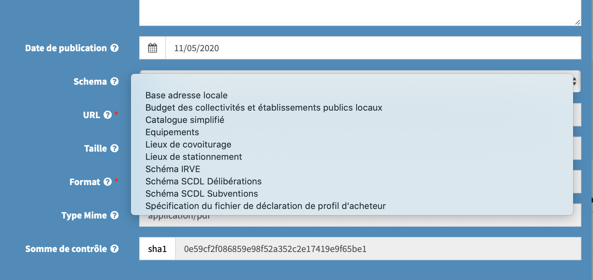
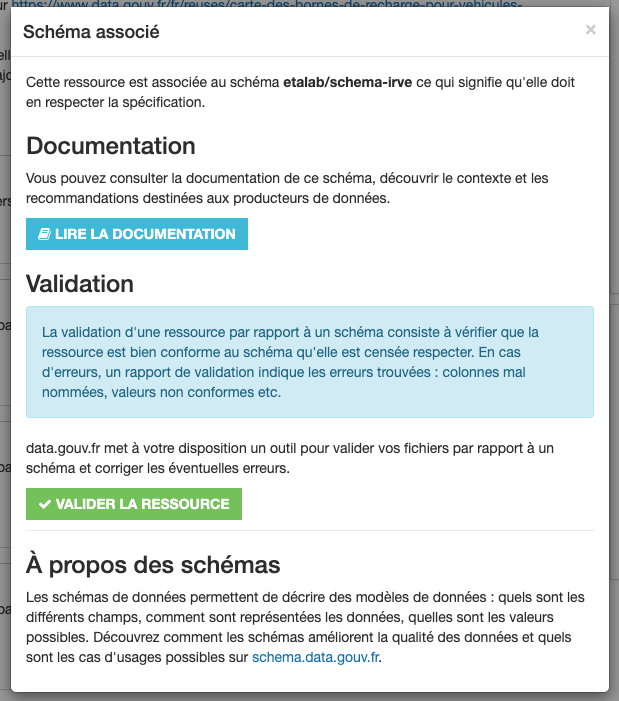
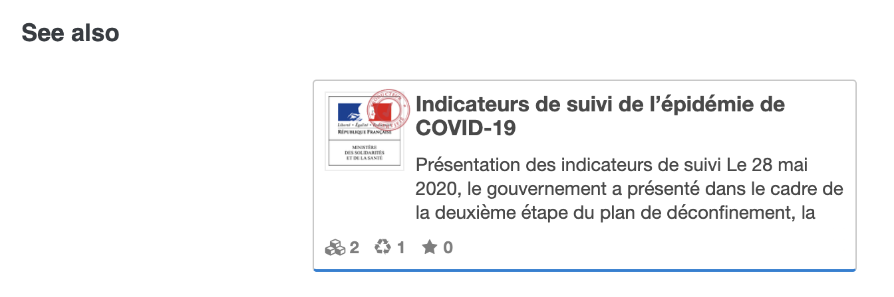

# Nouveautés data.gouv.fr été 2020 🌞

## Edito
🚀 Arrivée des « pages index ». 

Objectif : rassembler manuellement les données et autres ressources relatives à un thème donné, et permettre d’accueillir des contributions de la société civile. Aussi s’affranchir un peu de la lourdeur du backoffice de data.gouv.fr.

Solution : un [dépôt Github](https://github.com/etalab/datagouvfr-pages/tree/master/pages) accueille des pages en Markdown — donc avec possibilité pour chacun de faire des pull requests. Ces pages sont ensuite accessible à travers data.gouv.fr, comme par exemple [Les données relatives au COVID-19 en France](https://www.data.gouv.fr/fr/pages/donnees-coronavirus). Une page sommaire est aussi disponible : [Données clés par sujet - data.gouv.fr](https://www.data.gouv.fr/fr/pages/donnees-cles-par-sujet). Il est possible d’associer des jeux de données et des réutilisations aux pages index.

## Schémas
🚀 Intégration schema.data.gouv.fr <- -> data.gouv.fr

Il est maintenant possible de lier un schéma référencé sur schema.data.gouv.fr à une ressource data.gouv.fr.

Des infos relatives au schéma sont alors disponibles sur la ressource en question. On peut accéder au schema sur schema.data.gouv.fr et lancer la validation du fichier sur validata.etalab.studio.

On peut également accéder à la [liste des jeux de données réputés respecter un schéma, par exemple IRVE](https://www.data.gouv.fr/fr/datasets/?schema=etalab/schema-irve).

[Un article de blog sera consacré à ces nouveautés en septembre.](https://pad.incubateur.net/80SkcamPSwevDOGsLfpjwA)

## APIs
🚀 Les APIs d’api.gouv.fr sont sur data.gouv.fr

Il est maintenant possible côté api.gouv.fr de lier un à plusieurs jeux de données de data.gouv.fr, via son identifiant. [Par exemple ici pour le SIRENE](https://github.com/betagouv/api.gouv.fr/commit/9e2e988138ba6b752a428c1fa7e46a71dc357a60). On peut aussi référencer plusieurs APIs sur un même jeu de données.

Les infos de l’API s’affichent alors sous la description du jeu de données (sauf sur mobile), avec un lien vers api.gouv.fr.

Vos contributions sont les bienvenues pour relier des APIs à des jeux de données.

## Recommendations
🚀 Refonte et extension du système de recommendations

Depuis quelques temps déjà des recommendations sont disponibles sur le « top 50 » de nos jeu de données. Elles pointent vers des jeux de données fréquemment visités avant ou après le dit jeu de données du top 50.

Toutefois ces recommendations n’étaient pas mises à jour et il n’existait qu’une seule source de recommendation, sur laquelle nous n’avions pas la main.

Les recommendations relatives aux visites du top 50 (via stats.data.gouv.fr) sont désormais mises à jour plusieurs fois par semaine.

Il existe également deux nouvelles autres sources possibles de recommendations :
- [Des recommandations manuelles via ce dépôt](https://github.com/etalab/recommendations-edito)
- Des recommendations automatiques qui pointent vers le fichier consolidé quand un jeu de données fait partie des sources de ce fichier consolidé (eg un fichier « local » IRVE pointera vers le fichier consolidé)

C’est tout pour aujourd’hui 🎙.
